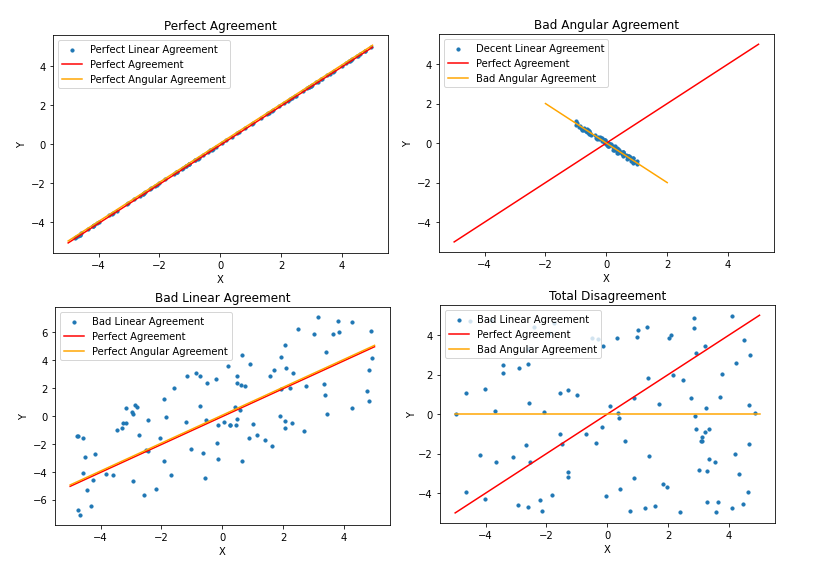
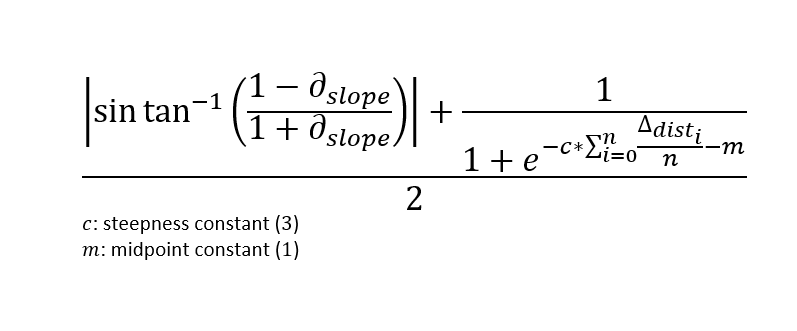

# Analyzing Explanation Disagreements
### Coen Adler

## Explanatory Results
Using available open source post-hoc explanatory methods, we can potentially get a better understanding as to how a ML model makes predictions. However, current explanatory models tend to have contradictory results. This creates a lack of confidence in these explanations. This brings up the question as to when can we trust these explanations. The first step is to identify whether these explanations actually contradict and *disagree*. This is what this module attempts to solve.

## Explanatory Agreement/Disagreement
So what does it mean for two sets of explanations to agree or disagree? Two sets are in perfect agreement if and only if all explanations from one model exactly match the respective explanations from the second model. From here, we can measure disagreement by the deviation from the perfect agreement. There are two majors ways to identify this deviation; this can be seen through a scatter plot where the explanations are the axes. A perfect agreement can be represented by the line y=x. For every explanation in model X there is an equal respective explanation in model Y. The first way of identifying deviation is through linear disagreement. Linear disagreement is the average distance each explanation set is from the perfect explanation, y=x. The second method is via angular disagreement or the difference in angles between the slope of the line of best fit for the perfect agreement and for the explanation comparison plot.

## Agreement Score
Agreement score is the value given to identify whether two explanations agree or disagree and to what degree. By defintion, a perfect agreement will be 0. Essentially, the score is a measure of unitless disagreement confidence. The score is calculated using both linear and angular disagreement. It is scored by taking the mean of the sine distance of the perfect agreement and the sets of explanations, and the mean linear distance explanation sets are from the perfect agreement with a logistic activation.

## Validation
The current Agreement Score has not been verified and has some fallicies. Verification of the agreement score requires a defintion behind what agreement means and while the defined definition is passing can be argued to be lacking in depth. Additionally, the Agreement Score values are hard to interpret as there is no clear translation of one value versus another. The score also assumes that linear and angular disagreement should be waited equally and the logistic activation requires constants that must be manually set. While there are default values it is impossible to prove what are the best constant values. The final issue that can arise has to do with overall small values and whether or not normalizing of linear distances should be done.